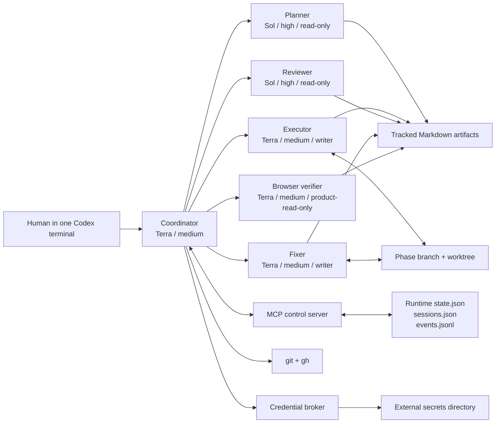
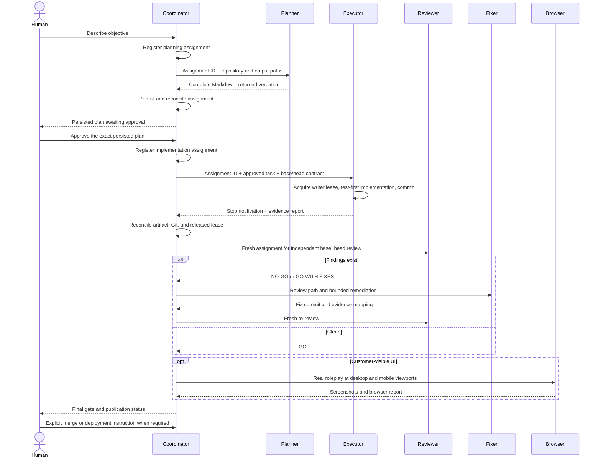
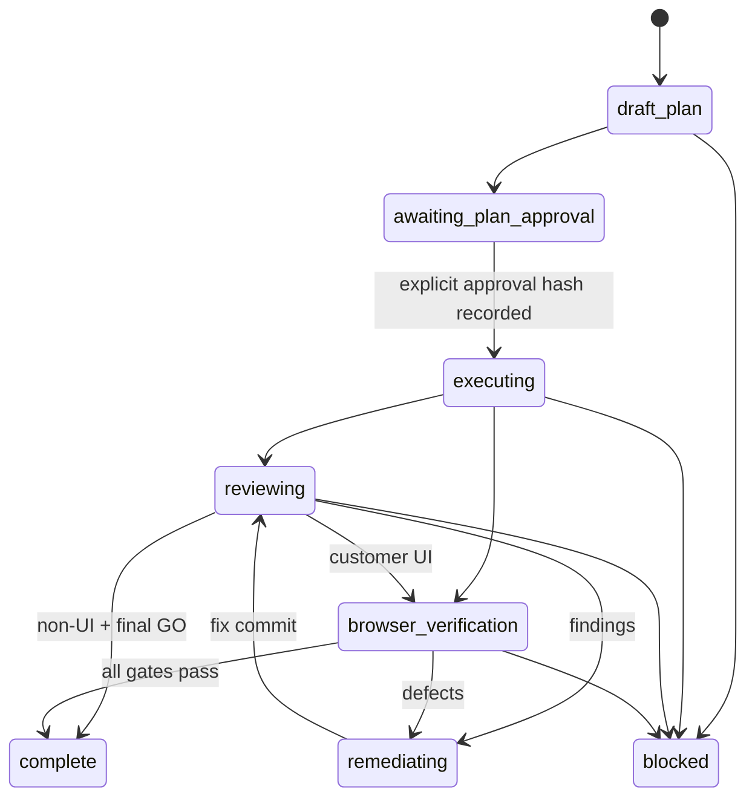

# Codex Dev Orchestrator

Codex Dev Orchestrator (CDO) turns one interactive Codex terminal into the durable “brain” for a plan → build → review → fix → browser-verify workflow. It uses explicit role assignments, native Codex subagents, lifecycle notifications, repository-tracked Markdown handoffs, an untracked runtime journal, exclusive writer leases, and explicit human gates. It does not require an OpenAI API key when Codex CLI is signed in with a supported ChatGPT subscription.

This repository is both the plugin source and the reference implementation. Version 0.2.x is intentionally local-first: install it from a personal marketplace, then use it to coordinate work in any local Git repository.

## Why this exists

Long coding chats accumulate stale assumptions, consume an expensive context window, and blur who planned, implemented, and approved a change. CDO keeps the main Codex session as the coordinator and gives each specialist a fresh context. Agents exchange file paths and concise routing metadata; the detailed contract lives in Markdown in the target repository.

The result is a workflow that can be closed and resumed without treating chat history as a database:

- a high-reasoning planner writes the specification and implementation plan;
- the human approves the exact persisted plan;
- a medium-cost executor implements one bounded task in an isolated phase worktree;
- a fresh high-reasoning reviewer checks risky tasks and the whole phase;
- a medium-cost fixer remediates findings;
- a medium-cost browser verifier evaluates real customer-visible behavior;
- the coordinator reconciles Git, artifacts, runtime state, worktrees, and PR state.

Superpowers is optional. CDO borrows its strongest ideas—written plans, test-first implementation, isolated worktrees, independent review, and evidence before completion—but implements its own durable contracts and does not import Superpowers at runtime.

## Architecture



The model remains the decision-maker. The TypeScript layer owns deterministic assignment lifecycle, state transitions, schema validation, context budgets, lease ownership, credential adapter execution, and guarded GitHub commands. `SubagentStart` and `SubagentStop` hooks bind native agent activity to durable assignments. A stop event is only a notification; reconciliation of the expected artifact and Git evidence is what advances the workflow.

### End-to-end sequence



## Role and cost policy

| Role | Default model | Effort | Access | Responsibility |
|---|---|---:|---|---|
| Coordinator | `gpt-5.6-terra` | medium | workspace | route work, persist state, enforce gates |
| Planner | `gpt-5.6-sol` | high | read-only | repository-grounded specs and plans |
| Reviewer | `gpt-5.6-sol` | high | read-only | independent task and whole-phase review |
| Executor | `gpt-5.6-terra` | medium | workspace writer | implement approved task |
| Fixer | `gpt-5.6-terra` | medium | workspace writer | remediate accepted findings |
| Browser verifier | `gpt-5.6-terra` | medium | product-read-only | live UI/UX and workflow evidence |

Only planner and reviewer use Sol/high. Maximum configured effort is high. The other roles use Terra/medium and may be changed to a cheaper compatible model in `.codex/workflow.toml` and `.codex/agents/*.toml`.

Native Codex subagents inherit the parent turn’s live permission overrides. The custom agent files narrow their defaults, but a parent session started with unrestricted permissions can broaden a child. Start the coordinator with the intended permission mode and review plugin hooks with `/hooks`.

## Requirements

- Node.js 20 or newer
- pnpm 9 or newer
- Codex CLI with native subagent and plugin support
- Git
- GitHub CLI (`gh`) only for push/PR automation
- Playwright-capable browser tooling for live UI gates
- a ChatGPT subscription that can use the configured Codex models, or an API-backed Codex setup if preferred

Check this machine:

```bash
node --version
pnpm --version
codex --version
git --version
gh --version
```

## Build and verify the source checkout

Clone and run from this repository:

```bash
gh repo clone wantanwonderland/codex-dev-orchestrator
cd codex-dev-orchestrator
pnpm install
pnpm verify
```

`pnpm verify` runs strict TypeScript checking, all unit/integration tests, the production build, plugin and skill validation, README/Mermaid validation, disposable-repository smoke coverage, source and packaged MCP smoke tests, and a self-doctor check.

## Install locally

The local installer creates one symlink at `~/plugins/codex-dev-orchestrator`, one `codex-dev-orchestrator` entry in `~/.agents/plugins/marketplace.json`, one guarded `cdo` CLI symlink, and one user-level Codex MCP registration. It refuses to replace unrelated paths, registrations, or a non-personal marketplace.

```bash
cd codex-dev-orchestrator
pnpm install:local
codex plugin add codex-dev-orchestrator@personal
```

Start a fresh Codex thread after installation so Codex discovers the new skill, hooks, and MCP server. The local installer registers the bundled MCP executable through `codex mcp add` using an absolute path; this avoids shell expansion and plugin-cache ambiguity. Run `/hooks`, inspect the exact bundled commands, and trust them. The hooks are hash-trusted; changed hooks require review again.

Verify installation:

```bash
codex plugin list
codex mcp get codex-dev-orchestrator
cdo doctor --self
```

## Initialize a target project

From any Git repository that should use the workflow:

```bash
PROJECT_ROOT="$(git rev-parse --show-toplevel)"
cd "$PROJECT_ROOT"
cdo init --project-id "$(basename "$PROJECT_ROOT")" --default-branch main
```

Initialization creates:

```text
.codex/
├── config.toml                    # coordinator model and subagent limits, if absent
├── config.cdo-recommended.toml    # written instead when config.toml already exists
├── workflow.toml                  # durable project policy
├── agents/
│   ├── coordinator.toml
│   ├── planner.toml
│   ├── executor.toml
│   ├── reviewer.toml
│   ├── fixer.toml
    │   └── browser-verifier.toml
├── cdo-managed.json               # installed template version and hashes
├── workflows/                     # tracked workflow contracts
└── workflow-runtime/              # ignored local runtime state
```

CDO never overwrites an existing `.codex/config.toml`. It writes `.codex/config.cdo-recommended.toml` for a human-reviewed merge instead. `cdo-managed.json` records stock agent-template hashes for safe future upgrades. CDO also adds `.codex/workflow-runtime/` to the target repository’s `.gitignore` without replacing existing rules.

The generated `.codex/workflow.toml` is complete and immediately usable:

```toml
[project]
id = "demo-project"
default_branch = "main"

[models]
coordinator = "gpt-5.6-terra"
planner = "gpt-5.6-sol"
reviewer = "gpt-5.6-sol"
worker = "gpt-5.6-terra"

[effort]
coordinator = "medium"
planner = "high"
reviewer = "high"
worker = "medium"

[workflow]
max_retry = 1
max_remediation_rounds = 2
require_plan_approval = true
auto_commit = true

[browser]
desktop_viewport = "1440x900"
mobile_viewport = "390x844"
require_live_for_customer_ui = true
allowed_roles = ["admin", "member", "customer"]

[credentials]
profile_names = ["local"]
allowed_environments = ["local", "test"]
allowed_hosts = ["localhost", "127.0.0.1"]

[git]
auto_push_checkpoint = true
auto_draft_pr = true
require_approval_if_deploy_coupled = true
```

Commit `.codex/workflow.toml`, `.codex/cdo-managed.json`, `.codex/agents/`, and `.gitignore` so every fresh session sees the same rules.

## Start workflows

### Small fix

A small fix gets one task brief:

```bash
cdo start "Fix duplicate email validation" --id fix-duplicate-email --tier small
```

Tracked contract:

```text
.codex/workflows/fix-duplicate-email/
├── index.md
├── tasks/task-1.md
├── reports/
├── reviews/
└── browser/
```

### Normal feature

A normal feature gets a shared specification and implementation plan:

```bash
cdo start "Add account-scoped saved filters" --id saved-filters --tier normal
```

Tracked contract:

```text
.codex/workflows/saved-filters/
├── index.md
├── spec.md
├── plan.md
├── tasks/
├── reports/
├── reviews/
└── browser/
```

### Large initiative

A large initiative additionally starts a phase plan and task brief:

```bash
cdo start "Unify approved response content" --id approved-content --tier large
```

Tracked contract:

```text
.codex/workflows/approved-content/
├── index.md
├── spec.md
├── plan.md
├── phases/phase-1.md
├── tasks/task-1.md
├── reports/
├── reviews/
└── browser/
```

The generated documents are scaffolds. In the interactive terminal, say:

```text
Use $orchestrating-development for workflow approved-content. Have the planner inspect the repository and replace the draft artifacts with a complete implementation contract. Do not implement until I approve the persisted plan.
```

The coordinator spawns the project-scoped `planner`, receives the complete artifact, and writes it verbatim. It may add routing metadata to front matter, but it must not silently rewrite the planner’s substantive plan.

## Plan approval

Starting a workflow leaves runtime state at `awaiting_plan_approval`. Read the exact tracked file, then explicitly approve it:

```bash
cdo validate-artifacts approved-content
cdo approve-plan approved-content --by shafuan
cdo transition approved-content executing
```

Approval records the approver, timestamp, and SHA-256 of the persisted plan. Editing the plan after approval changes its hash; the coordinator must return it for approval rather than treating the old approval as transferable.

## Execution, review, and remediation

The coordinator creates one feature branch and isolated Git worktree per phase. Before spawning a role agent, it registers the exact team handoff:

```bash
cdo assign approved-content \
  --operation task-1-implementation \
  --role executor \
  --stage implementation \
  --input tasks/task-1.md \
  --output reports/task-1.md \
  --kind executor-report
```

The returned assignment ID goes into the child prompt and the artifact front matter. After native spawn returns its child ID, the coordinator binds it deterministically with `cdo bind-agent WORKFLOW ASSIGNMENT --event start --agent CHILD_ID`. The `SubagentStart` and `SubagentStop` hooks perform the same lifecycle updates when routing is unambiguous; explicit binding is the recovery path when several workflows have the same role queued. The coordinator keeps its turn active, waits for the child, binds `stop` if needed, and does not report a handoff as successful yet.

The executor or fixer must acquire the exclusive writer lease using the actual Codex parent session ID:

```bash
cdo acquire-writer approved-content --role executor --session session-123
```

After tests, evidence report, a local commit, and lease release, the coordinator reconciles the stopped assignment:

```bash
cdo release-writer approved-content --session session-123
cdo reconcile approved-content ASSIGNMENT_ID
```

Reconciliation validates assignment identity, role, operation key, artifact kind and status, commit evidence, and released writer ownership. It returns `assign_reviewer`, `assign_fixer`, `assign_browser-verifier`, `continue_approved_plan`, `await_plan_approval`, `complete`, a one-time retry, or `human_reconciliation`. The coordinator follows that result immediately.

The lease prevents a second executor/fixer session from becoming the authorized writer. Planner and reviewer agents are configured read-only. Native subagent hook events identify the parent thread, so the coordinator passes that parent session ID into the lease call and never overlaps a reviewer with a writer. Hook policy blocks common write tools when the parent thread does not own an active lease. Because hooks cannot distinguish every child path and do not cover every specialized tool, read-only agent configuration, sequential routing, Git diff review, and isolated worktrees remain required defense-in-depth.

Every task matching one of these triggers receives an independent task review:

- schema or migrations;
- authentication, RBAC, or tenancy;
- privacy or security;
- billing;
- concurrency or queues;
- public APIs;
- external integrations;
- customer-visible UI.

Check routing directly:

```bash
cdo risk "tenant RBAC and a customer-visible dashboard"
```

Regardless of task risk, every phase ends with a fresh Sol/high whole-phase review written to:

```text
.codex/workflows/approved-content/reviews/phase-final.md
```

The review verdict is `GO`, `GO WITH FIXES`, or `NO-GO`. Findings include severity, file reference, impact, proof, and required remediation. A fixer can perform at most two remediation/re-review rounds. A crash, timeout, malformed result, or missing evidence gets one automatic fresh-session retry; a second failure is escalated to the human.

## Context and handoff budgets

CDO estimates four characters per token and rejects oversized inline handoffs instead of truncating them:

| Content | Maximum estimated tokens |
|---|---:|
| Coordinator routing prompt | 2,000 |
| Worker handoff, excluding files read through tools | 8,000 |
| Executor report | 3,000 |
| Review | 5,000 unless findings require more |

The routing prompt should contain the role, objective, exact artifact paths, base/head range, output path, and stopping rule. It should not copy the entire plan or diff. Oversized tasks go back to the planner for decomposition.

## Artifact contract

Every tracked Markdown artifact begins with validated YAML front matter:

```yaml
---
schema: cdo/v1
kind: task-brief
workflow_id: approved-content
phase: phase-1
task: task-1
status: approved
created_at: 2026-07-20T00:00:00.000Z
updated_at: 2026-07-20T00:00:00.000Z
source_commit: 43d17960
target_commit: 08e48463
assignment_id: 174f21ea-ae21-4a25-9078-85f52c149cc3
operation_key: task-1-implementation
agent_role: executor
---
```

The authoritative order is:

1. Git commits and the checked-out worktree.
2. Tracked workflow Markdown.
3. Runtime `state.json`, `sessions.json`, and `events.jsonl` for coordination.
4. GitHub PR/check state.
5. Chat history only as a convenience.

For workflow `approved-content`, runtime files live under `.codex/workflow-runtime/approved-content/`:

```text
state.json       # atomically replaced current state, mode 0600
events.jsonl     # append-only event history
sessions.json    # atomic cdo-sessions/v1 assignment and handoff ledger
logs/            # untracked diagnostic logs
```

`sessions.json` records every queued, running, stopped, reconciling, reconciled, failed, or blocked assignment. Writes are serialized with a cross-process lock and atomic replacement. `reconciling` persists the routing decision before workflow mutation so a repeated call can safely finish an interrupted reconciliation. `events.jsonl` remains the append-only audit stream. Both stay ignored because tracked Markdown and Git remain the cross-session delivery contract.

## Resume after closing Codex

Open the same target repository in a fresh terminal and say:

```text
Use $orchestrating-development to resume workflow approved-content from durable state. Reconcile any stopped assignment, then reconcile Git, tracked artifacts, the active worktree, runtime state, and any PR before routing the next agent.
```

Or inspect state first:

```bash
cdo status approved-content --json
cdo validate-artifacts approved-content
git worktree list --porcelain
git status --short --branch
gh pr view --json number,state,isDraft,headRefName,baseRefName,statusCheckRollup
```

Never infer completion from an old agent summary. If Git and runtime state disagree, stop automatic routing, preserve both sources, and reconcile from commit and event evidence.

`cdo status` reports the active role, assignment status, blocker, and deterministic next action:

```text
approved-content: reviewing (phase-1) | reviewer/running | next: wait_for_reviewer
```

## Production-standard browser verification

Customer-visible UI cannot pass on unit tests, type-checking, a build, or mocked rendering alone. The `browser-verifier` uses a real running application and approved local/test data.

Required coverage:

- 1440×900 desktop and 390×844 mobile viewports, unless project config overrides them;
- every relevant role and permission boundary;
- empty, loading, success, validation, error, disabled, and destructive-confirmation states;
- keyboard traversal, visible focus, labels, contrast signals, and basic screen-reader semantics;
- responsiveness, clipping, overflow, touch targets, hierarchy, copy, and task clarity;
- console errors, failed network requests, stale data, and duplicate requests;
- a named-persona, scene-by-scene roleplay of the real business workflow;
- screenshots for defects and final proof;
- exact reproduction and retest steps after remediation.

For workflow `approved-content`, the report is written to `.codex/workflows/approved-content/browser/report.md` with `kind: browser-report` and `status: passed` only after the real flow succeeds. If the browser cannot start or login fails, the gate is blocked. A waiver must be explicit, human-authored, and recorded; the verifier cannot waive its own gate.

Check the final gate:

```bash
cdo gate approved-content
```

For a UI workflow this requires both a passed `reviews/phase-final.md` and a passed `browser/report.md`. In a Git repository, each report’s `target_commit` must equal the current `HEAD`; stale evidence cannot satisfy the gate.

## Credentials without placing secrets in Git

Credentials live outside every worktree:

```text
~/.codex/workflow-secrets/
└── demo-project/
    ├── profiles.json
    ├── local-login-adapter
    └── auth-states/
```

Set directory mode 0700, profile files and generated browser state 0600, and adapters 0700. CDO refuses a secrets root inside the target project. Plaintext credentials are permitted by this design when the user chooses them, but the risk is explicit: any process with the same operating-system account and sufficient filesystem access may read them.

Repository config contains only profile names, environments, roles, and allowed hosts. `profiles.json` stays external and defines an absolute argv adapter, not a shell string:

```json
{
  "local": {
    "environment": "local",
    "allowedHosts": ["localhost"],
    "command": ["/home/alice/.codex/workflow-secrets/demo-project/local-login-adapter"]
  }
}
```

The adapter writes a Playwright-compatible storage-state object to stdout. CDO does not pass inherited secrets to the adapter, invokes no shell, validates the JSON shape, stores it as a random mode-0600 file, and returns only its path:

```bash
AUTH_RESULT="$(cdo auth-state --project-id demo-project --profile local --host localhost)"
AUTH_STATE="$(printf '%s' "$AUTH_RESULT" | node -e 'let s="";process.stdin.on("data",d=>s+=d).on("end",()=>process.stdout.write(JSON.parse(s).path))')"
printf '%s\n' "$AUTH_STATE"
```

Delete the short-lived state immediately after browser verification:

```bash
cdo delete-auth-state "$AUTH_STATE"
```

The deletion command refuses paths outside `~/.codex/workflow-secrets`. Use SSH aliases and the operating system SSH agent; do not copy private keys into profiles or worktrees.

Hooks flag direct `.codex/workflow-secrets` access and common production mutation commands. This is an accidental-misuse guardrail, not a complete hostile-agent security boundary. Strong isolation requires operating-system permissions, managed Codex deny-read policy, constrained parent permissions, or a separate execution account.

## Git, push, and PR policy

Executor and fixer agents create verified local commits automatically. CDO never force-pushes and never rewrites history. Stable checkpoints can be pushed and a draft PR created through `git` and authenticated `gh`:

```bash
cdo publish-checkpoint approved-content \
  --title "feat: approved response content" \
  --body-file .codex/workflows/approved-content/reports/pr-body.md \
  --deployment-reviewed
```

`--deployment-reviewed` is a deliberate acknowledgement that pushing this branch or opening its PR does not unexpectedly deploy it, or that the human approved that coupling. The command refuses the default branch, requires clean staged and unstaged diffs, pushes the current feature branch, and creates a draft PR if none exists.

After every workflow gate and required GitHub check passes, merging still requires explicit human approval:

```bash
cdo merge-pr approved-content --human-approved
```

The command runs required PR checks, marks the PR ready, squash-merges it, and deletes the remote branch. It does not deploy. Any deployment, production database migration, production write/delete, service restart, secret rotation, or production configuration mutation requires a separate explicit human instruction at the time of action.

## Autonomy modes

`cdo start` supports three recorded modes:

- `human_gated`: plan, remote publication, merge, and all production changes stop for human decisions.
- `local_auto`: after plan approval, local task routing, commits, reviews, fixes, and verification may continue automatically within policy.
- `remote_auto`: after plan approval, stable checkpoint push and draft PR updates may continue automatically when deployment coupling is approved; final merge and deployment retain the explicit gates described above.

Example:

```bash
cdo start "Add audit export" --id audit-export --tier normal --mode local_auto
```

The mode is a controller policy, not permission for individual agents to improvise external mutations.

## MCP tools

The packaged stdio MCP server, registered by `pnpm install:local`, exposes deterministic primitives to the coordinator:

| Tool | Purpose |
|---|---|
| `workflow_status` | load validated durable state |
| `classify_task_risk` | identify fixed mandatory-review triggers |
| `acquire_writer_lease` | grant one executor/fixer session write ownership |
| `release_writer_lease` | release only the owner’s lease |
| `transition_workflow` | enforce the state machine and plan gate |
| `completion_gate` | require final review and conditional browser proof |
| `persist_workflow_artifact` | validate and atomically persist role output verbatim |
| `record_agent_failure` | allow one fresh retry, then block and escalate |
| `record_agent_success` | clear an operation retry counter |
| `issue_browser_auth_state` | run an approved adapter and return a state path |
| `delete_browser_auth_state` | remove the short-lived state safely |

The MCP server does not itself call `codex exec` or hold API keys. The coordinator uses native Codex agent spawning, so subscription-backed authentication remains in Codex CLI.

## State machine



Invalid transitions fail. Execution without a persisted plan approval fails. Completion with an active writer lease fails.

## Troubleshooting

### `cdo` is not found

The local installer places a guarded symlink at `~/.local/bin/cdo`. Ensure that directory is in `PATH`. You can always use the source command:

```bash
cd codex-dev-orchestrator
node dist/cli.js doctor --self
```

### Plugin changes are not visible

Build, refresh the local installation, reinstall, and start a new thread:

```bash
cd codex-dev-orchestrator
pnpm refresh:local
codex plugin remove codex-dev-orchestrator@personal
codex plugin add codex-dev-orchestrator@personal
```

Then open `/hooks` in the new thread and trust the current hash.

Upgrade every existing initialized project without overwriting custom agent instructions:

```bash
PROJECT_ROOT="$(git rev-parse --show-toplevel)"
cd "$PROJECT_ROOT"
cdo upgrade-project
cdo doctor
```

Stock templates are updated in place. Customized templates are preserved and the new version is written beside them as `NAME.cdo-recommended.toml` for manual review.

### Existing `.codex/config.toml`

CDO preserves it and writes `.codex/config.cdo-recommended.toml`. Compare and merge only the model and `[agents]` settings you want.

### Writer lease is stuck

Inspect the session in Codex and the runtime event log. Do not delete state blindly. If the owning session is conclusively gone, record the recovery decision in the workflow index, then use the same recorded session ID to release the lease:

```bash
cdo status approved-content --json
cdo release-writer approved-content --session session-123
```

### Browser gate is blocked by authentication

Run the profile adapter manually as the operating-system user, validate that it emits Playwright storage-state JSON, confirm the requested host is allowlisted, issue a new state, and retry the exact scenario. Do not replace live proof with a unit test.

### Hook blocks an expected write

Confirm the current agent is executor or fixer, its real session ID owns the lease, and the active workflow state is in execution or remediation. Use `/hooks` to inspect the source and output. Do not disable hooks merely to bypass a genuine ownership conflict.

### Runtime state and Git disagree

Stop routing. Inspect `events.jsonl`, Git status/log, worktree list, tracked reports, and PR state. Treat Git commits as code truth and preserve the runtime journal as audit evidence. Reconcile explicitly in `index.md` before resuming.

## Uninstall

Remove the installed plugin first, then the local marketplace entry and source symlink, then unlink the CLI:

```bash
codex plugin remove codex-dev-orchestrator@personal
cd codex-dev-orchestrator
pnpm uninstall:local
```

The uninstaller refuses to remove `~/plugins/codex-dev-orchestrator`, the `cdo` CLI, or the MCP registration unless each belongs to this checkout. It does not delete target-project workflow artifacts, runtime histories, or credential directories.

## Security model and limitations

- CDO is a workflow controller, not a hardened multi-tenant sandbox.
- Native subagents inherit parent live permissions; choose the parent permission mode carefully.
- Hooks cover common shell, patch, and local tool paths, but specialized tools may bypass them.
- The writer lease is a durable authorization contract and audit signal; Git/worktree isolation remains necessary.
- Plaintext external credentials are an accepted local-machine risk, not a secure secret-manager replacement.
- Credential adapters are executable trusted code. Review them and use absolute paths.
- GitHub automation trusts local `git` and `gh` authentication.
- No force-push or history rewrite is implemented.
- Deployment is intentionally absent from the automation surface.

For higher assurance, combine CDO with managed Codex requirements, deny-read paths, constrained network domains, separate operating-system accounts, short-lived identity tokens, and protected GitHub branches.

## Development

Repository layout:

```text
.codex-plugin/plugin.json       plugin metadata
agents/                         native Codex role templates
hooks/                          lifecycle hook configuration
skills/orchestrating-development/
src/                            TypeScript controller, CLI, MCP, and policy code
test/                           Vitest contract tests
scripts/                        validation and local installation commands
docs/                           product contract and implementation record
```

Use test-first development for behavior changes:

```bash
pnpm test:watch
pnpm check
pnpm verify
```

Before changing agent behavior, update or add a pressure scenario, observe the baseline failure, make the smallest instruction change, and forward-test it in a fresh Codex context. Keep the core skill concise; detailed user guidance belongs in this README.

Version the plugin with semantic versioning. During local iteration, rebuild and reinstall so Codex refreshes its cached plugin copy. A Git-backed marketplace and public repository can be added later without changing the tracked workflow contract.

## License

MIT. See [LICENSE](LICENSE).
