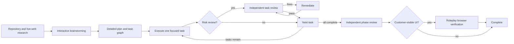
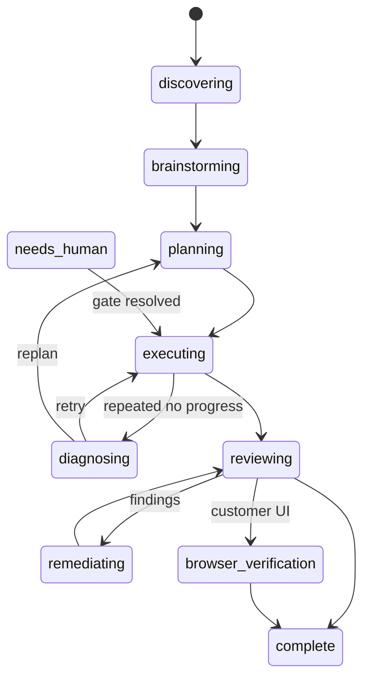
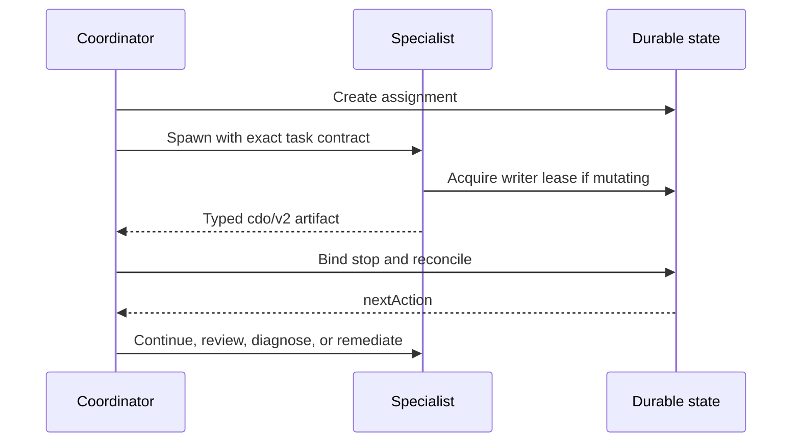

# Codex Dev Orchestrator

Codex Dev Orchestrator (CDO) is an autonomous, durable software-delivery plugin for Codex. It gives a coordinator a real state machine, repository-local evidence, role-specific fresh agents, exclusive writer leases, independent review, and live browser verification.

CDO 0.4 removes routine approval pauses. A workflow continues by itself through research, planning, implementation, diagnosis, remediation, and verification. It asks a human only when judgment or authority genuinely cannot be delegated.

## Flow







Small work starts at planning. Normal and large work require both repository research and current live-web research, followed by an interactive brainstorming conversation. Planning is not a summary: it produces a dependency-ordered bundle of independently executable `tasks/*.md` briefs with exact paths, steps, code or commands, acceptance criteria, verification, risk, and browser requirements.

## Human approval boundary

CDO continues automatically for partial implementation, missing implementation context, retryable tool failure, failed tests, failed review, remediation, task splitting, diagnosis, and replanning.

It pauses with `needs_human` only for:

- a material product decision;
- material scope expansion;
- credentials that cannot be obtained under local policy;
- a destructive operation;
- production mutation;
- merge or deployment authorization;
- a genuine external blocker.

Direct access to local `.codex/workflow-secrets` is allowed when `allow_direct_local_access = true`. Secret values must never be copied into agent prompts, workflow artifacts, logs, commits, or screenshots.

## Install locally

```bash
pnpm install
pnpm verify
pnpm refresh:local
```

Restart Codex after installation so plugin MCP and hook configuration are reloaded.

## Initialize a repository

```bash
cdo init --project-id my-project --default-branch main
cdo start "Add auditable account export" --id account-export --tier normal --mode autonomous
cdo status account-export
```

Initialization installs:

- `.codex/workflow.toml` — project policy;
- `.codex/config.toml` — Codex agent settings, or a recommendation if one exists;
- `.codex/agents/*.toml` — coordinator, researcher, planner, executor, reviewer, fixer, and browser verifier;
- `.codex/workflows/` — tracked durable evidence;
- `.codex/workflow-runtime/` — ignored runtime state and assignment ledger.

## Coordinator operations

```bash
cdo assign WORKFLOW --operation research --role researcher --stage research \
  --input index.md --output research.md --kind research

cdo bind-agent WORKFLOW ASSIGNMENT --event start --agent NATIVE_AGENT_ID
cdo bind-agent WORKFLOW ASSIGNMENT --event stop --agent NATIVE_AGENT_ID
cdo reconcile WORKFLOW ASSIGNMENT

# After decisions.md is persisted with status: ready
cdo record-decisions WORKFLOW

# Resume a resolved human gate
cdo resume WORKFLOW --to executing
```

MCP exposes equivalent operations, plus atomic artifact persistence, completion gates, risk classification, browser-auth handling, and failure/success recording.

## Typed agent outcomes

- `complete` / `passed`: advance normally.
- `partial`: preserve progress and continue the same task.
- `needs_context`: enrich the assignment and continue.
- `retryable_failure`: start a fresh attempt.
- `needs_replan`: return to planning and replace the affected task graph.
- `external_blocker`: request human help with exact evidence.
- `safety_gate`: request explicit authority before proceeding.

Three repeated operational failures route to a diagnosis assignment. There is no arbitrary two-attempt or two-remediation-round limit.

## Task brief contract

Every `status: ready` task brief uses `schema: cdo/v2` and must provide `task`, `depends_on`, `risk`, `review_required`, and `customer_visible_ui`. Its body must include:

```markdown
# Task title

## Context
## Acceptance criteria
## Steps
## Verification
```

It must name exact repository paths and include fenced code or commands. Placeholder language is rejected, dependency cycles are rejected, and only dependency-ready tasks can execute.

## Safety and recovery

Only a running executor or fixer holding the workflow writer lease may mutate source. Agent assignments are persisted before spawn, explicitly bound to native IDs, stopped, validated against their exact `cdo/v2` artifact and Git evidence, and reconciled idempotently. Runtime files use atomic replacement and an append-only event stream.

Local checkpoints may be committed automatically. Push, PR merge, deployment, production changes, and destructive actions retain explicit human gates.

## Dashboard

```bash
cdo dashboard add-root ~/Documents/projects
cdo dashboard
```

The local dashboard shows research, brainstorming, planning, execution, diagnosis, review, remediation, browser verification, task progress, agent assignments, evidence history, token telemetry, and typed human gates. It is monitor-only and binds to loopback by default.

## Maintenance

```bash
cdo upgrade-project
cdo validate-artifacts WORKFLOW
cdo gate WORKFLOW
cdo doctor
cdo doctor --self
```

To remove only CDO workflow artifacts and runtime from an initialized project while preserving project configuration and agents:

```bash
cdo reset-project --confirm
```

## Development verification

```bash
pnpm check
pnpm test
pnpm test:web
pnpm build
pnpm validate:plugin
pnpm validate:skills
pnpm validate:readme
pnpm test:smoke
pnpm test:mcp
pnpm test:packaged-mcp
pnpm test:dashboard
```
